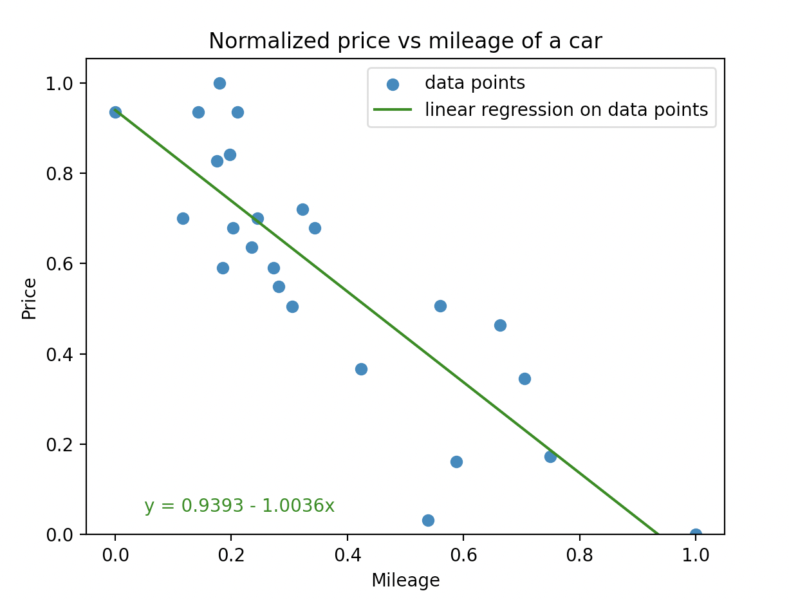
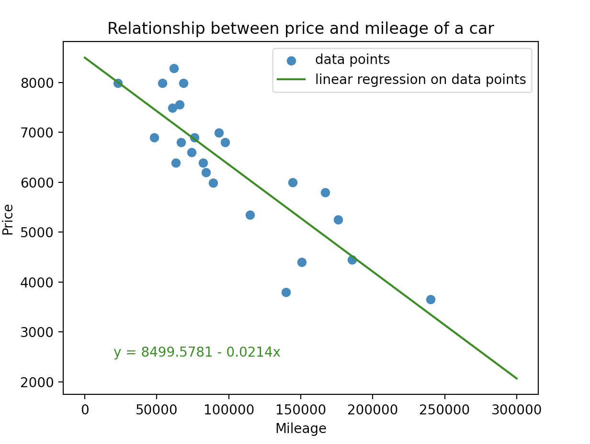
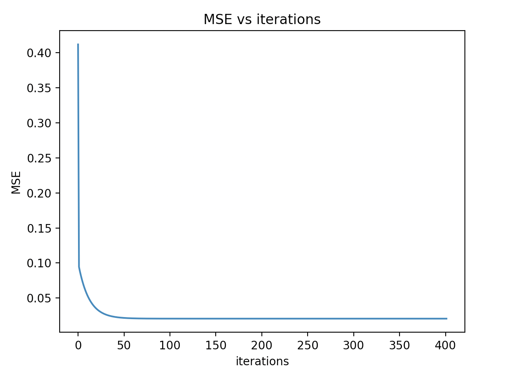
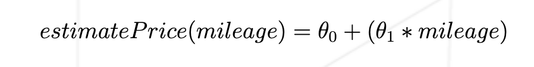
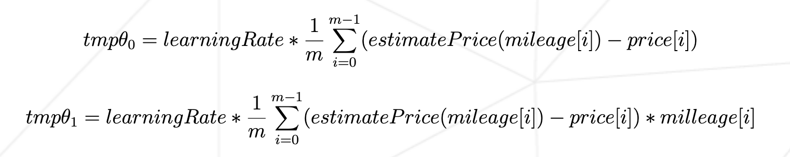

# ft_linear_regression

The goal of this project is to implement a simple linear regression with a single feature - in this case, the mileage of the car

## Usage
There are 3 programs, one or training, one for predicting and one for the precision
```
python3 train.py [flags]
Optional flags:
-v              plot original data with linear regression equation
-v-normalized   plot normalized data with linear regression equation
-e              plot MSE vs iterations
-h              prints usage info
```
```
python3 predict.py
```
```
python3 precision.py
```

## Output
Graphs when using flags with the training program</br>


## Mandatory

Create a program that will predict the price of a car for a given mileage.
When you launch the program, it should prompt you for a mileage, and then give you back the estimated price for that mileage.
The program will use the following hypothesis to predict the price :</br>
                                  
Before the run of the training program, theta0 and theta1 will be set to 0

</br>
Create another program that will train your model. It will read the dataset file and perform a linear regression on the data.
Once the linear regression has completed, the variables theta0 and theta1 are saved in the <i><b>thetas.txt</b></i> for use in the first program.
You will be using the following formulas :</br>


## Bonus

  - Added a program to show the precision of the linear regression equation
  - Added a flag for plotting the original data and the linear regression equation
  - Added a flag for plotting the normalized data and the linear regression equation
  - Added a flag for plotting the MSE vs iterations
